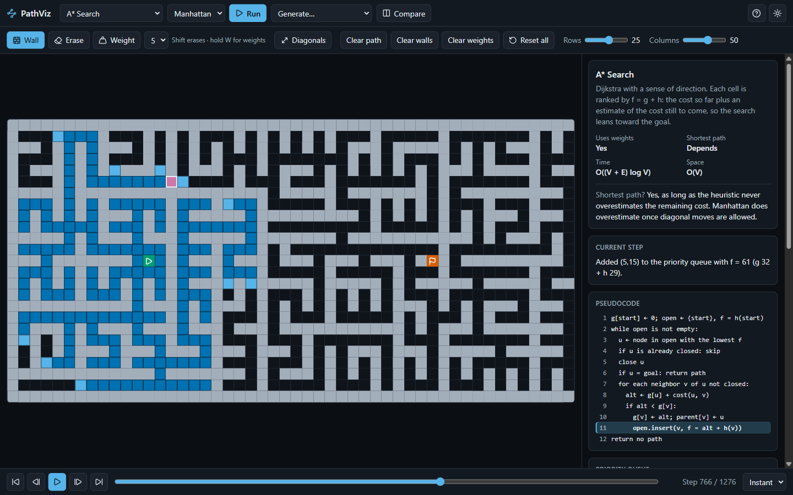
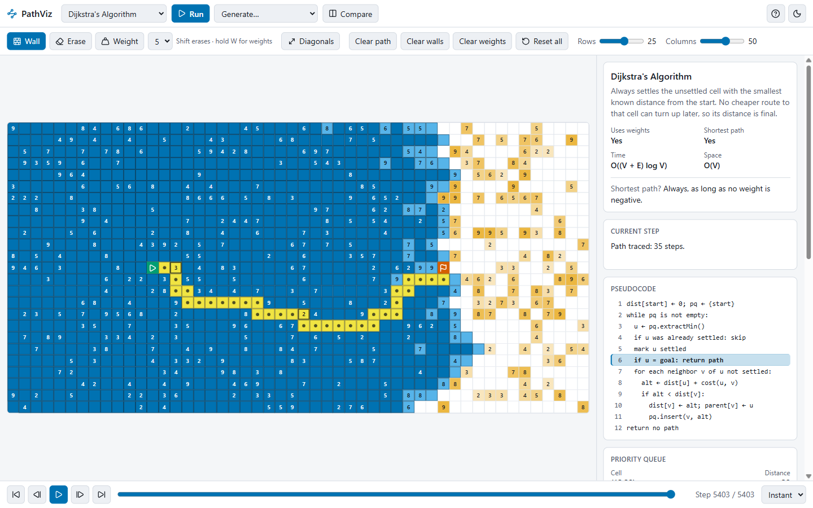
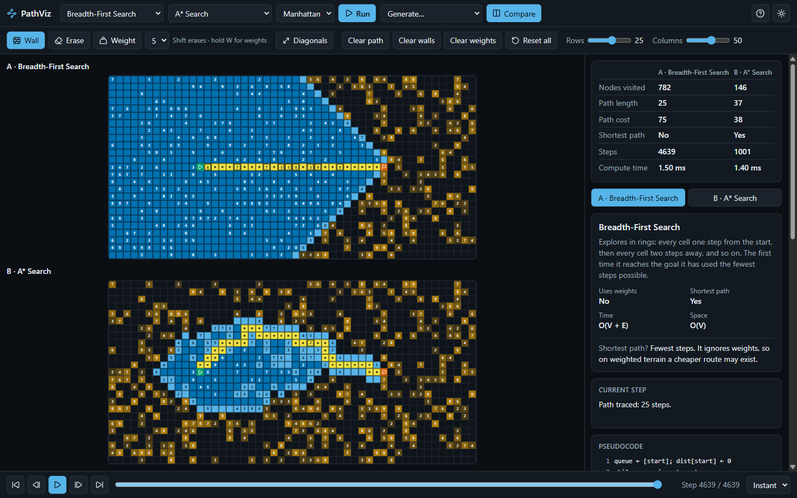
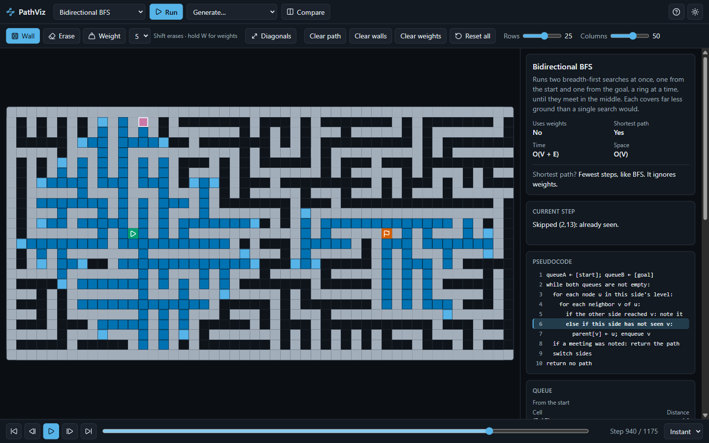

# PathViz

An interactive visualizer for shortest-path and graph-search algorithms. Draw a
grid, pick an algorithm, and watch it run one operation at a time. You can pause
at any step, move forward or backward, and see which line of pseudocode is
running, what the frontier holds, and why each distance changed.



## Features

- **Seven algorithms**: Breadth-First Search, Depth-First Search, Dijkstra, A*
  with four heuristics, Greedy Best-First, Bidirectional BFS and Bellman-Ford.
- **Reversible playback**: play, pause, step forward, step back, jump to either
  end, scrub a timeline, and choose a speed from 0.25× to 10× or instant.
- **Explanations for every step**: highlighted pseudocode, a live view of the
  queue, stack or priority queue, a plain-English sentence, per-cell inspection
  and run statistics.
- **Grid editor**: draw walls, paint weights from 1 to 9, drag the start and
  end, toggle diagonal movement, resize the grid.
- **Generators**: three maze algorithms, random walls and random weights, each
  drawn as it is built.
- **Compare mode**: two algorithms on the same grid in step with each other,
  with a summary table at the end.
- **Accessible**: keyboard operable throughout, labelled controls, a
  colour-blind-safe palette with a second cue for every role, light and dark
  themes, and no animation when reduced motion is requested.

## Getting started

Requires Node.js 20 or newer.

```bash
npm install
npm run dev
```

Then open the address Vite prints, usually <http://localhost:5173>.

| Script            | What it does                                     |
| ----------------- | ------------------------------------------------ |
| `npm run dev`     | Start the development server                     |
| `npm run build`   | Type-check and build for production into `dist/` |
| `npm run preview` | Serve the production build locally               |
| `npm test`        | Run the test suite once                          |
| `npm run lint`    | Lint with ESLint; warnings fail                  |
| `npm run format`  | Format with Prettier                             |

## Using it

### Editing the grid

| Action                | Mouse or touch                    | Keyboard, with focus in the grid  |
| --------------------- | --------------------------------- | --------------------------------- |
| Draw walls            | Drag with the Wall tool           | Enter toggles a wall              |
| Erase                 | Shift + drag, or the Erase tool   | Enter on a wall, or 1 on a weight |
| Paint weights         | Hold W + drag, or the Weight tool | 1–9 sets the weight               |
| Move the start or end | Drag the marker                   | S or E moves it to the cursor     |
| Move around           | —                                 | Arrow keys                        |

The grid is a single tab stop. Any edit discards the current run, because a run
describes one exact grid.

### Playback shortcuts

| Key        | Action                                       |
| ---------- | -------------------------------------------- |
| Space      | Play or pause; starts a run if there is none |
| → / ←      | Step forward / back                          |
| R          | Pause and return to the first step           |
| Home / End | Jump to the first / last step                |

Space is left to a focused dropdown or a button reached with the keyboard, and
the arrow keys are left to the grid and to sliders.

### Movement and cost

- Entering a cell costs its weight. A diagonal move costs the weight × √2.
- A diagonal move is only allowed when both cells beside it are open, so a path
  never cuts a wall corner.
- BFS, DFS and Bidirectional BFS count every move as one step and ignore
  weights. Their reported path cost still uses the real costs, so comparisons
  between algorithms are fair.
- "Shortest path" in the stats and in compare mode is measured, not assumed:
  each path is checked against Dijkstra's result on the same grid.

## Algorithms

| Algorithm            | Frontier                 | Uses weights | Shortest path                 | Time             | Space |
| -------------------- | ------------------------ | ------------ | ----------------------------- | ---------------- | ----- |
| Breadth-First Search | queue                    | no           | yes, in steps                 | O(V + E)         | O(V)  |
| Depth-First Search   | stack                    | no           | no                            | O(V + E)         | O(V)  |
| Dijkstra             | binary heap on g         | yes          | yes                           | O((V + E) log V) | O(V)  |
| A*                   | binary heap on f = g + h | yes          | yes, if h never overestimates | O((V + E) log V) | O(V)  |
| Greedy Best-First    | binary heap on h         | no           | no                            | O((V + E) log V) | O(V)  |
| Bidirectional BFS    | two queues               | no           | yes, in steps                 | O(V + E)         | O(V)  |
| Bellman-Ford         | none, repeated passes    | yes          | yes                           | O(V · E)         | O(V)  |

A* offers Manhattan, Euclidean, Octile and Chebyshev heuristics. Manhattan
overestimates once diagonal moves are allowed, and the app says so when you
pick that combination.

## Screenshots

|                                                                                           |                                                                                          |
| ----------------------------------------------------------------------------------------- | ---------------------------------------------------------------------------------------- |
|  |  |
| Dijkstra on random weights, light theme                                                   | Compare mode: BFS against A*, with the summary                                           |
|          |                       |
| Bidirectional BFS in a Prim maze                                                          | A* part-way through a recursive-division maze                                            |

## How it works

```
src/
  algorithms/   one pure function per algorithm, plus grid helpers, heap, heuristics
  generators/   one pure function per generator
  engine/       playback (replay and seeking) and narration
  data/         the algorithm registry: metadata, pseudocode, run function
  store/        Zustand stores: grid, playback, UI settings
  hooks/        playback loop, shortcuts, pointer and keyboard editing, cell painter
  components/   grid, top bar, playback bar, sidebar panels, tour
  utils/        seeded random numbers, formatting
```

**Algorithms know nothing about the interface.** Each one takes
`(grid, start, end, options)` and returns an ordered list of step events:

```ts
type StepEvent =
  | { type: 'visit'; node: CellId; line: number; side?: Side }
  | { type: 'enqueue'; node: CellId; priority?: number; h?: number; line: number; side?: Side }
  | {
      type: 'relax';
      node: CellId;
      from: CellId;
      oldDist: number;
      newDist: number;
      line: number;
      side?: Side;
    }
  | { type: 'skip'; node: CellId; reason: string; line: number }
  | { type: 'pass'; n: number; line: number }
  | { type: 'found'; node: CellId; line: number }
  | { type: 'path'; nodes: CellId[]; line: number }
  | { type: 'noPath'; line: number };
```

A cell is identified by its flat index, `row * cols + col`. `line` is the
1-based line of the algorithm's pseudocode, which is how the highlight stays in
step with the grid.

**The playback engine replays events.** `engine/playback.ts` applies events to
a small set of typed arrays (status, distance, parent, priority and so on). It
keeps a copy of that state every 50 events, or every 1/200th of the run if that
is longer, so reaching any step means restoring the nearest earlier copy and
re-applying a few events. Stepping back is the same operation as scrubbing.

**The grid is rendered once.** Cells are memoised and re-render only when their
own wall, weight or endpoint changes. Search state never goes through React: a
painter compares each cell's state with what it last drew and writes a
`data-state` attribute only where they differ.

Design notes are in [`docs/specs`](docs/specs) and the build plan in
[`docs/plans`](docs/plans).

## Adding an algorithm

Two steps: one new file and one registry entry.

**1. Write the function** in `src/algorithms/`. It must be pure and return step
events. A minimal example that walks east from the start until it hits the goal
or an obstacle:

```ts
// src/algorithms/eastward.ts
import { tracePath } from './grid';
import type { Algorithm, StepEvent } from './types';

export const eastward: Algorithm = (grid, start, end) => {
  const parent = new Int32Array(grid.rows * grid.cols).fill(-1);
  const events: StepEvent[] = [
    { type: 'relax', node: start, from: -1, oldDist: Infinity, newDist: 0, line: 1 },
  ];

  for (let u = start, steps = 0; ; u++, steps++) {
    events.push({ type: 'visit', node: u, line: 2 });
    if (u === end) {
      events.push(
        { type: 'found', node: u, line: 3 },
        { type: 'path', nodes: tracePath(parent, end), line: 3 },
      );
      return events;
    }
    const next = u + 1;
    if (next % grid.cols === 0 || grid.walls[next]) break;
    parent[next] = u;
    events.push({
      type: 'relax',
      node: next,
      from: u,
      oldDist: Infinity,
      newDist: steps + 1,
      line: 4,
    });
  }

  events.push({ type: 'noPath', line: 5 });
  return events;
};
```

Conventions the engine relies on:

- Announce the start with a `relax` whose `from` is `-1`.
- Emit `relax` when a cell's distance or parent changes, `enqueue` when it
  enters the frontier, and `visit` when it leaves the frontier to be expanded.
- End with `found` then `path`, or with `noPath`.
- Use `neighbors` and `stepCost` from `./grid` so the movement rules stay the
  same for every algorithm.

**2. Register it** in `src/data/algorithms.ts`:

```ts
{
  id: 'eastward',
  name: 'Eastward Walk',
  run: eastward,
  description: 'Walks east until it reaches the goal or something in the way.',
  weighted: false,
  optimal: 'no',
  optimalNote: 'No. It only ever looks in one direction.',
  time: 'O(V)',
  space: 'O(V)',
  frontier: 'none',          // 'queue' | 'stack' | 'heap' | 'none'
  usesHeuristic: false,
  pseudocode: [
    'dist[start] ← 0',
    'u ← current cell',
    'if u = goal: return path',
    'step east; parent[next] ← u',
    'return no path',
  ],
},
```

The picker, the algorithm card, the pseudocode panel, the data-structure panel
and compare mode all read this registry, so nothing else needs to change. The
playback tests and the pseudocode-sync test also run over every registered
algorithm automatically.

## Testing

```bash
npm test
```

- **Algorithms**: known costs on fixed grids, no-path handling, walls and
  weights respected, diagonal movement and the corner rule, and the pseudocode
  line carried by every kind of event.
- **Properties over 200 seeded random grids**: A* matches Dijkstra's cost for
  every admissible heuristic, Bellman-Ford matches Dijkstra, BFS matches
  Dijkstra on unweighted grids, Bidirectional BFS matches BFS, and no algorithm
  ever beats Dijkstra.
- **Playback engine**: stepping forward N then back N returns the initial state;
  seeking to any step equals replaying from scratch; the head of the frontier is
  always the next cell visited.
- **Generators**: endpoints stay open, mazes are always solvable, the same seed
  gives the same maze.
- **Interface**: controls, shortcuts, painting, every sidebar panel, compare
  mode, the tour, themes and keyboard editing. The highlighted pseudocode line
  is checked against the current event at every step of every algorithm.

## Tech stack

React 18, TypeScript in strict mode, Vite, Tailwind CSS, Framer Motion, Zustand,
lucide-react, Vitest and React Testing Library, ESLint and Prettier.
